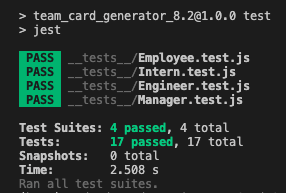

# Team_Card_Generator_10.3

## Title: Team Card Generator
 

## Description:
A Node.js command-line application that takes in information about employees on a software engineering team and generates an HTML webpage that displays summaries for each person.
  

## Video Demo:  
https://www.loom.com/share/5cbf6da0363a4e73addeaf622a9ba84d

## Link:  
repo: https://github.com/xnd0/Team_Card_Generator_10.3
 
video: https://www.loom.com/share/5cbf6da0363a4e73addeaf622a9ba84d
  

## Screenshots:

 

## Technologies Used:
Javascript, CSS, HTML, NodeJS, Inquirer